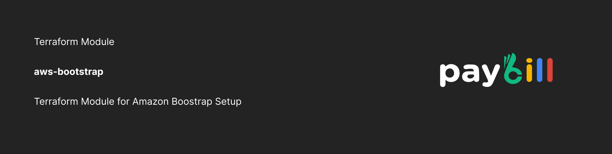

  <a href="https://paybill.dev" target="_blank">
    <picture>
      
    </picture>
  </a>

# AWS Bootstrap Terraform Module

Terraform relies on persistent state data to monitor the resources under its management. This enables collaborative access to the state data, allowing multiple individuals to collaborate on the management of a set of infrastructure resources. This module creates and configures a S3 bucket backend along with a DynamoDB lock table to store Terraform state files. As a best practice use this module to create the backend for Terraform

<!-- BEGIN_TF_DOCS -->
## Requirements

| Name | Version |
|------|---------|
|  [terraform](#requirement\_terraform) | >= 1.3.0 |
|  [aws](#requirement\_aws) | >= 5.0.0 |

## Providers

| Name | Version |
|------|---------|
|  [aws](#provider\_aws) | >= 5.0.0 |

## Modules

No modules.

## Resources

| Name | Type |
|------|------|
| [aws_dynamodb_table.terraform_state_lock](https://registry.terraform.io/providers/hashicorp/aws/latest/docs/resources/dynamodb_table) | resource |
| [aws_s3_bucket.private](https://registry.terraform.io/providers/hashicorp/aws/latest/docs/resources/s3_bucket) | resource |
| [aws_s3_bucket_acl.this](https://registry.terraform.io/providers/hashicorp/aws/latest/docs/resources/s3_bucket_acl) | resource |
| [aws_s3_bucket_analytics_configuration.private_analytics_config](https://registry.terraform.io/providers/hashicorp/aws/latest/docs/resources/s3_bucket_analytics_configuration) | resource |
| [aws_s3_bucket_cors_configuration.this](https://registry.terraform.io/providers/hashicorp/aws/latest/docs/resources/s3_bucket_cors_configuration) | resource |
| [aws_s3_bucket_inventory.inventory](https://registry.terraform.io/providers/hashicorp/aws/latest/docs/resources/s3_bucket_inventory) | resource |
| [aws_s3_bucket_lifecycle_configuration.this](https://registry.terraform.io/providers/hashicorp/aws/latest/docs/resources/s3_bucket_lifecycle_configuration) | resource |
| [aws_s3_bucket_logging.this](https://registry.terraform.io/providers/hashicorp/aws/latest/docs/resources/s3_bucket_logging) | resource |
| [aws_s3_bucket_ownership_controls.this](https://registry.terraform.io/providers/hashicorp/aws/latest/docs/resources/s3_bucket_ownership_controls) | resource |
| [aws_s3_bucket_policy.this](https://registry.terraform.io/providers/hashicorp/aws/latest/docs/resources/s3_bucket_policy) | resource |
| [aws_s3_bucket_public_access_block.public_access_block](https://registry.terraform.io/providers/hashicorp/aws/latest/docs/resources/s3_bucket_public_access_block) | resource |
| [aws_s3_bucket_server_side_encryption_configuration.example](https://registry.terraform.io/providers/hashicorp/aws/latest/docs/resources/s3_bucket_server_side_encryption_configuration) | resource |
| [aws_s3_bucket_versioning.this](https://registry.terraform.io/providers/hashicorp/aws/latest/docs/resources/s3_bucket_versioning) | resource |
| [aws_caller_identity.current](https://registry.terraform.io/providers/hashicorp/aws/latest/docs/data-sources/caller_identity) | data source |
| [aws_iam_policy_document.policy](https://registry.terraform.io/providers/hashicorp/aws/latest/docs/data-sources/iam_policy_document) | data source |
| [aws_partition.current](https://registry.terraform.io/providers/hashicorp/aws/latest/docs/data-sources/partition) | data source |

## Inputs

| Name | Description | Type | Default | Required |
|------|-------------|------|---------|:--------:|
|  [abort\_incomplete\_multipart\_upload\_days](#input\_abort\_incomplete\_multipart\_upload\_days) | Specifies the number of days after initiating a multipart upload when the multipart upload must be completed. | `number` | `14` | no |
|  [bucket\_key\_enabled](#input\_bucket\_key\_enabled) | Whether or not to use Amazon S3 Bucket Keys for SSE-KMS. | `bool` | `false` | no |
|  [bucket\_name](#input\_bucket\_name) | The name of the bucket. | `string` | n/a | yes |
|  [cors\_rules](#input\_cors\_rules) | List of maps containing rules for Cross-Origin Resource Sharing. | `list(any)` | `[]` | no |
|  [dynamo\_kms\_master\_key\_id](#input\_dynamo\_kms\_master\_key\_id) | The Default ID of an AWS-managed customer master key (CMK) for Amazon Dynamo | `string` | `null` | no |
|  [dynamodb\_hash\_key](#input\_dynamodb\_hash\_key) | The attribute to use as the hash (partition) key. | `string` | `"LockID"` | no |
|  [dynamodb\_name](#input\_dynamodb\_name) | The name of the table, this needs to be unique within a region. | `string` | n/a | yes |
|  [enable\_analytics](#input\_enable\_analytics) | Enables storage class analytics on the bucket. | `bool` | `true` | no |
|  [enable\_bucket\_force\_destroy](#input\_enable\_bucket\_force\_destroy) | A boolean that indicates all objects (including any locked objects) should be deleted from the bucket so that the bucket can be destroyed without error. | `bool` | `false` | no |
|  [enable\_bucket\_inventory](#input\_enable\_bucket\_inventory) | If set to true, Bucket Inventory will be enabled. | `bool` | `false` | no |
|  [enable\_bucket\_logging](#input\_enable\_bucket\_logging) | Enable bucket activity logging. | `bool` | `false` | no |
|  [enable\_dynamodb\_point\_in\_time\_recovery](#input\_enable\_dynamodb\_point\_in\_time\_recovery) | Whether to enable point-in-time recovery - note that it can take up to 10 minutes to enable for new tables. | `bool` | `true` | no |
|  [enable\_s3\_public\_access\_block](#input\_enable\_s3\_public\_access\_block) | Bool for toggling whether the s3 public access block resource should be enabled. | `bool` | `true` | no |
|  [enable\_versioning](#input\_enable\_versioning) | Enable versioning. Once you version-enable a bucket, it can never return to an unversioned state. | `bool` | `true` | no |
|  [expiration](#input\_expiration) | Specifies a period in the object's expire. | `list(any)` | <pre>[   {     "expired_object_delete_marker": true   } ]</pre> | no |
|  [inventory\_bucket\_format](#input\_inventory\_bucket\_format) | The format for the inventory file. Default is ORC. Options are ORC or CSV. | `string` | `"ORC"` | no |
|  [kms\_master\_key\_id](#input\_kms\_master\_key\_id) | The AWS KMS master key ID used for the SSE-KMS encryption. | `string` | `""` | no |
|  [logging\_bucket\_name](#input\_logging\_bucket\_name) | The S3 bucket to send S3 access logs. | `string` | `""` | no |
|  [logging\_bucket\_target\_prefix](#input\_logging\_bucket\_target\_prefix) | To specify a key prefix for log objects. | `string` | `""` | no |
|  [mfa\_delete](#input\_mfa\_delete) | mfa\_delete is disabled | `bool` | `false` | no |
|  [noncurrent\_version\_expiration](#input\_noncurrent\_version\_expiration) | Number of days until non-current version of object expires | `number` | `365` | no |
|  [noncurrent\_version\_transitions](#input\_noncurrent\_version\_transitions) | Non-current version transition blocks | `list(any)` | <pre>[   {     "days": 30,     "storage_class": "STANDARD_IA"   } ]</pre> | no |
|  [schedule\_frequency](#input\_schedule\_frequency) | The S3 bucket inventory frequency. Defaults to Weekly. Options are 'Weekly' or 'Daily'. | `string` | `"Weekly"` | no |
|  [sse\_algorithm](#input\_sse\_algorithm) | The server-side encryption algorithm to use. Valid values are AES256 and aws:kms | `string` | `"AES256"` | no |
|  [tags](#input\_tags) | A mapping of tags to assign to the bucket. | `map(string)` | <pre>{   "Module": "bootstrap",   "TerraformManaged": "true" }</pre> | no |
|  [transitions](#input\_transitions) | Current version transition blocks | `list(any)` | `[]` | no |

## Outputs

| Name | Description |
|------|-------------|
|  [bucket\_arn](#output\_bucket\_arn) | Bucket's ARN |
|  [bucket\_id](#output\_bucket\_id) | Bucket's ID |
|  [bucket\_name](#output\_bucket\_name) | Bucket's Name |
|  [dynamodb\_arn](#output\_dynamodb\_arn) | DynamoDB's ARN |
|  [dynamodb\_id](#output\_dynamodb\_id) | DynamoDB's ID |
|  [dynamodb\_name](#output\_dynamodb\_name) | DynamoDB's Name |
<!-- END_TF_DOCS -->